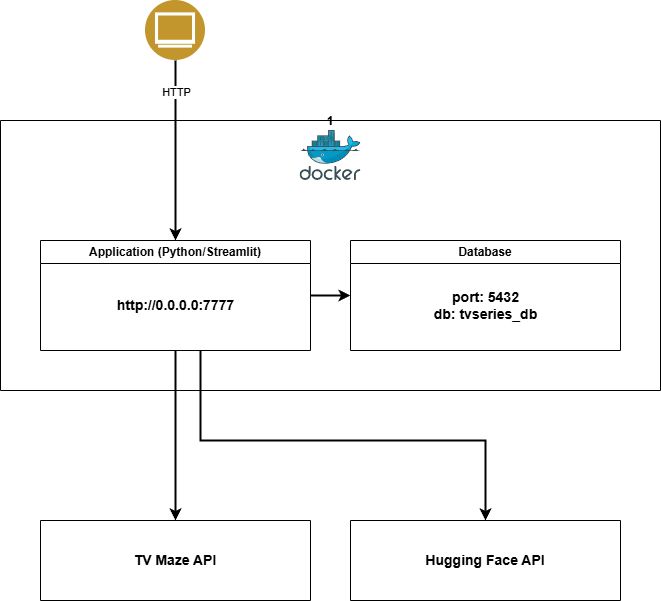

# TV Series Explorer - Architecture Technical Challenge

Este projeto é um módulo central de uma plataforma de streaming focado na busca e interação com séries de TV. Ele foi desenhado com foco estrito em **Arquitetura Limpa (Clean Architecture)**, **Princípios SOLID** e alta manutenibilidade, servindo como referência técnica para times de desenvolvimento.

 

## 🏛️ Decisões Arquiteturais

Para garantir a separação de responsabilidades e a independência de frameworks, o projeto adota os seguintes padrões:

* **Clean Architecture & Inversão de Dependência (DIP):** O coração da aplicação (`core/`) contém apenas regras de negócio e contratos (Interfaces/ABCs). Ele não conhece detalhes sobre Banco de Dados, APIs externas ou Frameworks Web.
* **Padrão Adapter:** As integrações com o TVMaze, PostgreSQL e Hugging Face (IA) estão isoladas na camada `adapters/`. Isso permite trocar qualquer tecnologia subjacente sem alterar uma única linha de código da lógica de negócio.
* **Resiliência e Fallback:** A integração com a IA possui tratamento de erros elegante. Caso a API de LLM falhe ou demore a responder, o sistema retorna um insight padrão de fallback, não quebrando a experiência do usuário.

 

## 📁 Estrutura de Diretórios

* `/core`: Entidades de domínio, Interfaces e Casos de Uso.
* `/adapters`: Implementações concretas (TVMaze HTTP Client, Hugging Face API, Postgres Repository).
* `app.py`: Ponto de entrada da aplicação.

 

## 🚀 Como Executar a Aplicação

1. **Clone o repositório:**
   ```bash
   git clone https://github.com/seu-usuario/tv-series-app.git
   cd tv-series-app
   ```

2. **Configure a Chave de IA (Opcional):**
   Exporte a sua chave da API do Hugging Face para o seu ambiente. Caso não faça isso, a aplicação usará graciosamente a estratégia de fallback arquitetada.

   * **Linux / Mac:**
     ```bash
     export HF_API_KEY="sua_chave_hugging_face_aqui"
     export DATABASE_URL="postgresql://app_user:app_password@db:5432/tvseries_db"
     ```
   * **Windows (PowerShell):**
     ```powershell
     $env:HF_API_KEY="sua_chave_hugging_face_aqui"
     $env:DATABASE_URL="postgresql://app_user:app_password@db:5432/tvseries_db"
     ```

3. **Execute a aplicação:**
   ```bash
   docker compose up --build
   ```

4. **Acesse o sistema:**
   Abra o seu navegador e acesse: [http://localhost:7777](http://localhost:7777).

 

## 🧪 Como Preparar o Ambiente e Rodar os Testes

Os testes cobrem a lógica de negócio isolada (`Core`). Para executá-los, é necessário preparar um ambiente virtual local:

1. **Crie o ambiente virtual na raiz do projeto:**
   ```bash
   python -m venv venv
   ```

2. **Ative o ambiente virtual:**
   * **Linux / Mac:**
     ```bash
     source venv/bin/activate
     ```
   * **Windows:**
     ```cmd
     venv\Scripts\activate
     ```

3. **Instale as dependências da aplicação:**
   ```bash
   pip install -r requirements.txt
   ```

4. **Execute a suíte de testes:**
   ```bash
   pytest tests/
   ```